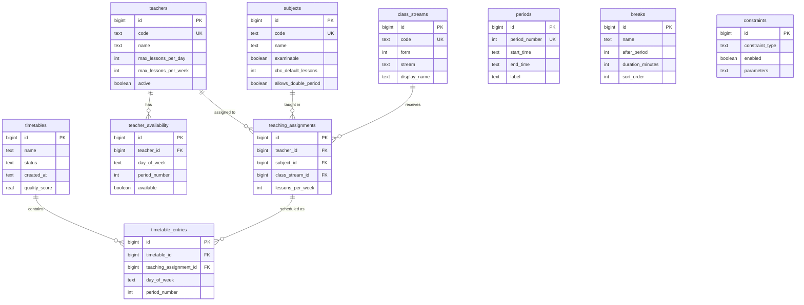

# ER Diagram

## Relationships

- **teaching_assignments** is the central scheduling unit linking teacher, subject, and class.
- **teacher_availability** stores per-slot availability; `available = 0` means forbidden.
- **periods** and **breaks** define the school calendar (no FK to assignments).
- **timetable_entries** materialize a generated timetable; each row is one lesson placement.
