# Class Diagram

```mermaid
classDiagram
    direction TB

    class TimetableGenerator {
        +generate(context) TimetableGenerationResult
    }

    class GreedyScheduler {
        +schedule(context) PartialSchedule
    }

    class BacktrackingScheduler {
        +resolve(context, partial) TimetableGenerationResult
    }

    class HardConstraintValidator {
        +canPlace(entry, schedule, context) boolean
        +validateComplete(schedule, context) ValidationResult
    }

    class SoftConstraintScorer {
        +score(schedule, context) double
    }

    class OptimizationStrategy {
        <<interface>>
        +optimize(schedule, context) TimetableGenerationResult
    }

    TimetableGenerator --> GreedyScheduler
    TimetableGenerator --> BacktrackingScheduler
    TimetableGenerator --> HardConstraintValidator
    TimetableGenerator --> SoftConstraintScorer
    TimetableGenerator ..> OptimizationStrategy : optional Phase 3

    class GenerateTimetableUseCase {
        -TimetableRepository timetableRepo
        -TeachingAssignmentRepository assignmentRepo
        -TimetableGenerator generator
        +execute(command) TimetableDto
    }

    class TeacherManagementUseCase {
        -TeacherRepository teacherRepo
        +create(dto) TeacherDto
        +update(dto) TeacherDto
        +delete(id) void
        +findAll() List~TeacherDto~
    }

    class ExportTimetableUseCase {
        -TimetableRepository timetableRepo
        -TimetableExporter exporter
        +exportPdf(timetableId, path) void
        +exportExcel(timetableId, path) void
    }

    class TeacherRepository {
        <<interface>>
        +save(Teacher) Teacher
        +findById(Long) Optional~Teacher~
        +findAll() List~Teacher~
        +deleteById(Long) void
    }

    class SqliteTeacherRepository {
        +save(Teacher) Teacher
        +findById(Long) Optional~Teacher~
    }

    class TeacherManagementController {
        -TeacherManagementUseCase useCase
        +onSave() void
        +onDelete() void
    }

    GenerateTimetableUseCase --> TimetableGenerator
    GenerateTimetableUseCase --> TimetableRepository
    TeacherManagementUseCase --> TeacherRepository
    ExportTimetableUseCase --> TimetableExporter
    SqliteTeacherRepository ..|> TeacherRepository
    TeacherManagementController --> TeacherManagementUseCase
```



## Layer Dependencies

```
thorium-ui  →  thorium-application  →  thorium-domain
                    ↓
            thorium-infrastructure (implements ports)
```

UI never references infrastructure directly; wiring happens in `AppContext`.
