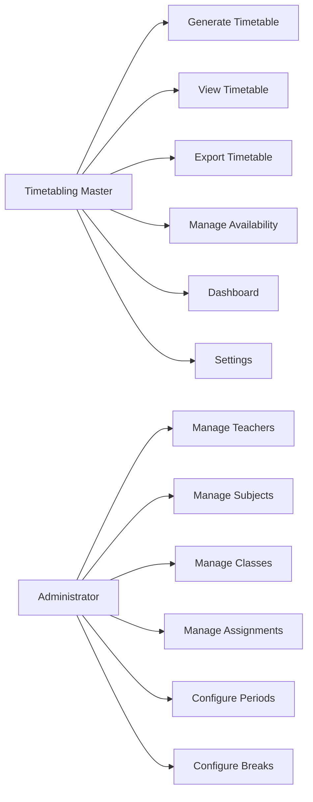

# Use Cases

## UC-01 Dashboard
View summary counts (teachers, subjects, classes, assignments, latest timetable status).

## UC-02 Manage Teachers
Create, update, delete, and list teachers with workload limits.

## UC-03 Manage Subjects
Create, update, delete subjects with CBC/examinable settings.

## UC-04 Manage Classes
Create, update, delete class streams (form + stream).

## UC-05 Manage Teaching Assignments
Link teacher + subject + class with weekly lesson count.

## UC-06 Configure Periods
Define period count, start/end times, labels.

## UC-07 Configure Breaks
Define breaks (assembly, tea, lunch) with duration and placement.

## UC-08 Manage Teacher Availability
Mark specific day/period slots as unavailable.

## UC-09 Generate Timetable
Run greedy + backtracking scheduler; persist result with quality score.

## UC-10 View Timetable
Display class-centric or teacher-centric grid views.

## UC-11 Export Timetable
Export to PDF or Excel for printing/distribution.

## UC-12 Settings
Configure working days, CBC no-double-lesson rule, database path.

---

## Actors
- **Timetabling Master** — primary user for all use cases
- **Principal / Deputy** — view and export published timetables
- **Administrator** — manage master data (teachers, subjects, classes)

## Use Case Diagram

