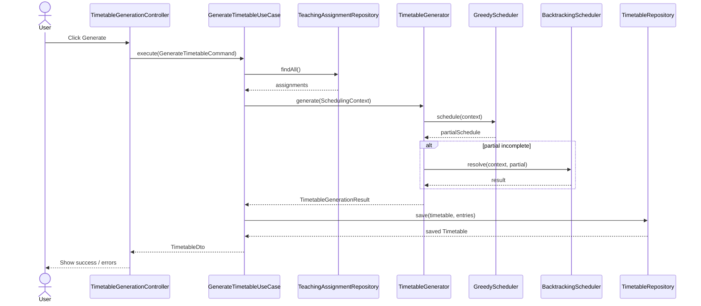
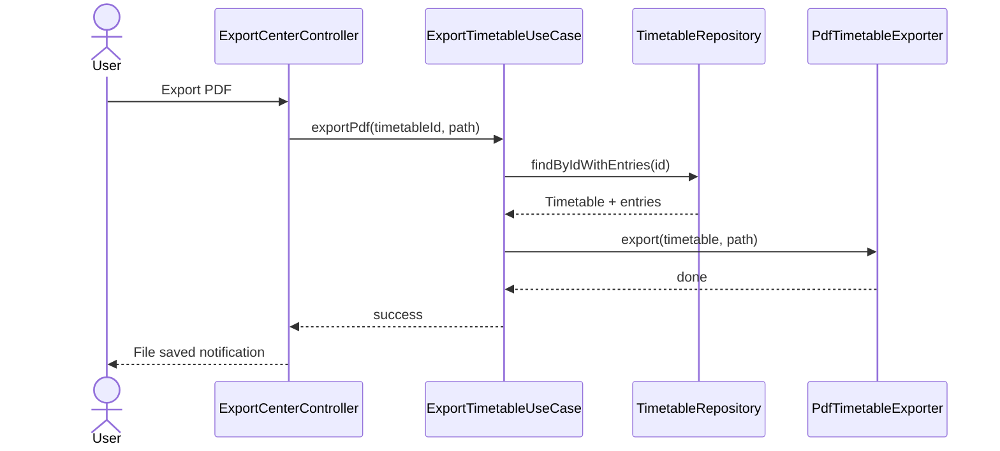
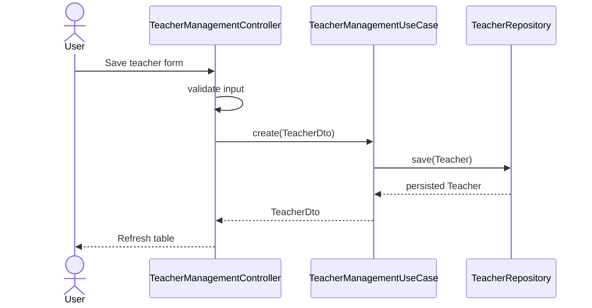

# Sequence Diagrams

## Generate Timetable

```mermaid
sequenceDiagram
    actor User
    participant Ctrl as TimetableGenerationController
    participant UC as GenerateTimetableUseCase
    participant AssignRepo as TeachingAssignmentRepository
    participant Gen as TimetableGenerator
    participant Greedy as GreedyScheduler
    participant BT as BacktrackingScheduler
    participant TTRepo as TimetableRepository

    User->>Ctrl: Click Generate
    Ctrl->>UC: execute(GenerateTimetableCommand)
    UC->>AssignRepo: findAll()
    AssignRepo-->>UC: assignments
    UC->>Gen: generate(SchedulingContext)
    Gen->>Greedy: schedule(context)
    Greedy-->>Gen: partialSchedule
    alt partial incomplete
        Gen->>BT: resolve(context, partial)
        BT-->>Gen: result
    end
    Gen-->>UC: TimetableGenerationResult
    UC->>TTRepo: save(timetable, entries)
    TTRepo-->>UC: saved Timetable
    UC-->>Ctrl: TimetableDto
    Ctrl-->>User: Show success / errors
```

## Export Timetable (PDF)

```mermaid
sequenceDiagram
    actor User
    participant Ctrl as ExportCenterController
    participant UC as ExportTimetableUseCase
    participant TTRepo as TimetableRepository
    participant Exp as PdfTimetableExporter

    User->>Ctrl: Export PDF
    Ctrl->>UC: exportPdf(timetableId, path)
    UC->>TTRepo: findByIdWithEntries(id)
    TTRepo-->>UC: Timetable + entries
    UC->>Exp: export(timetable, path)
    Exp-->>UC: done
    UC-->>Ctrl: success
    Ctrl-->>User: File saved notification
```

## Manage Teacher

```mermaid
sequenceDiagram
    actor User
    participant Ctrl as TeacherManagementController
    participant UC as TeacherManagementUseCase
    participant Repo as TeacherRepository

    User->>Ctrl: Save teacher form
    Ctrl->>Ctrl: validate input
    Ctrl->>UC: create(TeacherDto)
    UC->>Repo: save(Teacher)
    Repo-->>UC: persisted Teacher
    UC-->>Ctrl: TeacherDto
    Ctrl-->>User: Refresh table
```
